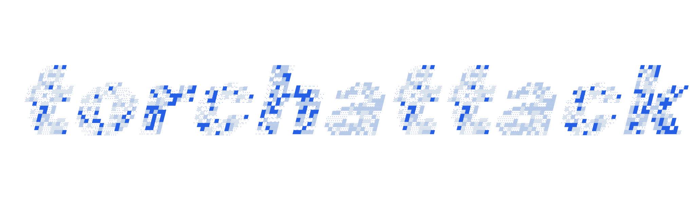

<div align="center">
  <p><br></p>
</div>

---

[](https://github.com/astral-sh/ruff)
[](https://pypi.python.org/pypi/torchattack)
[](https://pypi.python.org/pypi/torchattack)
[](https://pypi.python.org/pypi/torchattack)
[](https://github.com/spencerwooo/torchattack/actions/workflows/ci.yml)

🛡 **torchattack** - _A curated list of adversarial attacks in PyTorch, with a focus on transferable black-box attacks._

```shell
pip install torchattack
```

## Highlights

- 🛡️ A curated collection of adversarial attacks implemented in PyTorch.
- 🔍 Focuses on gradient-based transferable black-box attacks.
- 📦 Easily load pretrained models from torchvision or timm using `AttackModel`.
- 🔄 Simple interface to initialize attacks with `create_attack`.
- 🔧 Extensively typed for better code quality and safety.
- 📊 Tooling for fooling rate metrics and model evaluation in `eval`.
- 🔁 Numerous attacks reimplemented for readability and efficiency (TGR, VDC, etc.).

## Documentation

torchattack's docs are available at [docs.swo.moe/torchattack](https://docs.swo.moe/torchattack/).

## Usage

```python
import torch

device = torch.device('cuda' if torch.cuda.is_available() else 'cpu')
```

Load a pretrained model to attack from either torchvision or timm.

```python
from torchattack import AttackModel

# Load a model with `AttackModel`
model = AttackModel.from_pretrained(model_name='resnet50').to(device)
# `AttackModel` automatically attach the model's `transform` and `normalize` functions
transform, normalize = model.transform, model.normalize

# Additionally, to explicitly specify where to load the pretrained model from (timm or torchvision),
# prepend the model name with 'timm/' or 'tv/' respectively, or use the `from_timm` argument, e.g.
vit_b16 = AttackModel.from_pretrained(model_name='timm/vit_base_patch16_224').to(device)
inv_v3 = AttackModel.from_pretrained(model_name='tv/inception_v3').to(device)
pit_b = AttackModel.from_pretrained(model_name='pit_b_224', from_timm=True).to(device)
```

Initialize an attack by importing its attack class.

```python
from torchattack import FGSM, MIFGSM

# Initialize an attack
adversary = FGSM(model, normalize, device)

# Initialize an attack with extra params
adversary = MIFGSM(model, normalize, device, eps=0.03, steps=10, decay=1.0)
```

Initialize an attack by its name with `create_attack()`.

```python
from torchattack import create_attack

# Initialize FGSM attack with create_attack
adversary = create_attack('FGSM', model, normalize, device)

# Initialize PGD attack with specific eps with create_attack
adversary = create_attack('PGD', model, normalize, device, eps=0.03)

# Initialize MI-FGSM attack with extra args with create_attack
attack_args = {'steps': 10, 'decay': 1.0}
adversary = create_attack('MIFGSM', model, normalize, device, eps=0.03, **attack_args)
```

Check out [examples/](examples/mifgsm_transfer.py) and [`torchattack.evaluate.runner`](torchattack/evaluate/runner.py) for full examples.

## Attacks

<table>
  <thead>
    <tr>
      <th>Name</th>
      <th>Class Name</th>
      <th>Publication</th>
      <th>Paper (Open Access)</th>
    </tr>
  </thead>
  <tbody>
    <!-- Gradient-based attacks -->
    <tr>
      <th colspan="4">Gradient-based attacks</th>
    </tr>
    <tr>
      <td>FGSM</td>
      <td><code>FGSM</code></td>
      <td></td>
      <td><a href="https://arxiv.org/abs/1412.6572">Explaining and Harnessing Adversarial Examples</a></td>
    </tr>
    <tr>
      <td>PGD</td>
      <td><code>PGD</code></td>
      <td></td>
      <td><a href="https://arxiv.org/abs/1706.06083">Towards Deep Learning Models Resistant to Adversarial Attacks</a></td>
    </tr>
    <tr>
      <td>PGD (L2)</td>
      <td><code>PGDL2</code></td>
      <td></td>
      <td><a href="https://arxiv.org/abs/1706.06083">Towards Deep Learning Models Resistant to Adversarial Attacks</a></td>
    </tr>
    <tr>
      <td>MI-FGSM</td>
      <td><code>MIFGSM</code></td>
      <td></td>
      <td><a href="https://arxiv.org/abs/1710.06081">Boosting Adversarial Attacks with Momentum</a></td>
    </tr>
    <tr>
      <td>DI-FGSM</td>
      <td><code>DIFGSM</code></td>
      <td></td>
      <td><a href="https://arxiv.org/abs/1803.06978">Improving Transferability of Adversarial Examples with Input Diversity</a></td>
    </tr>
    <tr>
      <td>TI-FGSM</td>
      <td><code>TIFGSM</code></td>
      <td></td>
      <td><a href="https://arxiv.org/abs/1904.02884">Evading Defenses to Transferable Adversarial Examples by Translation-Invariant Attacks</a></td>
    </tr>
    <tr>
      <td>NI-FGSM</td>
      <td><code>NIFGSM</code></td>
      <td></td>
      <td><a href="https://arxiv.org/abs/1908.06281">Nesterov Accelerated Gradient and Scale Invariance for Adversarial Attacks</a></td>
    </tr>
    <tr>
      <td>SI-NI-FGSM</td>
      <td><code>SINIFGSM</code></td>
      <td></td>
      <td><a href="https://arxiv.org/abs/1908.06281">Nesterov Accelerated Gradient and Scale Invariance for Adversarial Attacks</a></td>
    </tr>
    <tr>
      <td>DR</td>
      <td><code>DR</code></td>
      <td></td>
      <td><a href="https://arxiv.org/abs/1911.11616">Enhancing Cross-Task Black-Box Transferability of Adversarial Examples With Dispersion Reduction</a></td>
    </tr>
    <tr>
      <td>VMI-FGSM</td>
      <td><code>VMIFGSM</code></td>
      <td></td>
      <td><a href="https://arxiv.org/abs/2103.15571">Enhancing the Transferability of Adversarial Attacks through Variance Tuning</a></td>
    </tr>
    <tr>
      <td>VNI-FGSM</td>
      <td><code>VNIFGSM</code></td>
      <td></td>
      <td><a href="https://arxiv.org/abs/2103.15571">Enhancing the Transferability of Adversarial Attacks through Variance Tuning</a></td>
    </tr>
    <tr>
      <td>Admix</td>
      <td><code>Admix</code></td>
      <td></td>
      <td><a href="https://arxiv.org/abs/2102.00436">Admix: Enhancing the Transferability of Adversarial Attacks</a></td>
    </tr>
    <tr>
      <td>FIA</td>
      <td><code>FIA</code></td>
      <td></td>
      <td><a href="https://arxiv.org/abs/2107.14185">Feature Importance-aware Transferable Adversarial Attacks</a></td>
    </tr>
    <tr>
      <td>PNA-PatchOut</td>
      <td><code>PNAPatchOut</code></td>
      <td></td>
      <td><a href="https://arxiv.org/abs/2109.04176">Towards Transferable Adversarial Attacks on Vision Transformers</a></td>
    </tr>
    <tr>
      <td>NAA</td>
      <td><code>NAA</code></td>
      <td></td>
      <td><a href="https://arxiv.org/abs/2204.00008">Improving Adversarial Transferability via Neuron Attribution-Based Attacks</a></td>
    </tr>
    <tr>
      <td>SSA</td>
      <td><code>SSA</code></td>
      <td></td>
      <td><a href="https://arxiv.org/abs/2207.05382">Frequency Domain Model Augmentation for Adversarial Attack</a></td>
    </tr>
    <tr>
      <td>TGR</td>
      <td><code>TGR</code></td>
      <td></td>
      <td><a href="https://arxiv.org/abs/2303.15754">Transferable Adversarial Attacks on Vision Transformers with Token Gradient Regularization</a></td>
    </tr>
    <tr>
      <td>ILPD</td>
      <td><code>ILPD</code></td>
      <td></td>
      <td><a href="https://arxiv.org/abs/2304.13410">Improving Adversarial Transferability via Intermediate-level Perturbation Decay</a></td>
    </tr>
    <tr>
      <td>MIG</td>
      <td><code>MIG</code></td>
      <td></td>
      <td><a href="https://openaccess.thecvf.com/content/ICCV2023/html/Ma_Transferable_Adversarial_Attack_for_Both_Vision_Transformers_and_Convolutional_Networks_ICCV_2023_paper.html">Transferable Adversarial Attack for Both Vision Transformers and Convolutional Networks via Momentum Integrated Gradients</a></td>
    </tr>
    <tr>
      <td>GRA</td>
      <td><code>GRA</code></td>
      <td></td>
      <td><a href="https://openaccess.thecvf.com/content/ICCV2023/html/Zhu_Boosting_Adversarial_Transferability_via_Gradient_Relevance_Attack_ICCV_2023_paper.html">Boosting Adversarial Transferability via Gradient Relevance Attack</a></td>
    </tr>
    <tr>
      <td>DeCoWA</td>
      <td><code>DeCoWA</code></td>
      <td></td>
      <td><a href="https://arxiv.org/abs/2402.03951">Boosting Adversarial Transferability across Model Genus by Deformation-Constrained Warping</a></td>
    </tr>
    <tr>
      <td>VDC</td>
      <td><code>VDC</code></td>
      <td></td>
      <td><a href="https://ojs.aaai.org/index.php/AAAI/article/view/28541">Improving the Adversarial Transferability of Vision Transformers with Virtual Dense Connection</a></td>
    </tr>
    <tr>
      <td>BSR</td>
      <td><code>BSR</code></td>
      <td></td>
      <td><a href="https://arxiv.org/abs/2308.10299">Boosting Adversarial Transferability by Block Shuffle and Rotation</a></td>
    </tr>
    <tr>
      <td>L2T</td>
      <td><code>L2T</code></td>
      <td></td>
      <td><a href="https://arxiv.org/abs/2405.14077">Learning to Transform Dynamically for Better Adversarial Transferability</a></td>
    </tr>
    <tr>
      <td>ATT</td>
      <td><code>ATT</code></td>
      <td></td>
      <td><a href="https://openreview.net/forum?id=sNz7tptCH6">Boosting the Transferability of Adversarial Attack on Vision Transformer with Adaptive Token Tuning</a></td>
    </tr>
    <tr>
      <td>BFA</td>
      <td><code>BFA</code></td>
      <td></td>
      <td><a href="https://www.sciencedirect.com/science/article/pii/S0925231224006349">Improving the transferability of adversarial examples through black-box feature attacks</a></td>
    </tr>
    <tr>
      <td>MuMoDIG</td>
      <td><code>MuMoDIG</code></td>
      <td></td>
      <td><a href="https://www.arxiv.org/abs/2412.18844">Improving Integrated Gradient-based Transferable Adversarial Examples by Refining the Integration Path</a></td>
    </tr>
    <!-- Generative attacks -->
    <tr>
      <th colspan="4">Generative attacks</th>
    </tr>
    <tr>
      <td>CDA</td>
      <td><code>CDA</code></td>
      <td></td>
      <td><a href="https://arxiv.org/abs/1905.11736">Cross-Domain Transferability of Adversarial Perturbations</a></td>
    </tr>
    <tr>
      <td>LTP</td>
      <td><code>LTP</code></td>
      <td></td>
      <td><a href="https://proceedings.neurips.cc/paper/2021/hash/7486cef2522ee03547cfb970a404a874-Abstract.html">Learning Transferable Adversarial Perturbations</a></td>
    </tr>
    <tr>
      <td>BIA</td>
      <td><code>BIA</code></td>
      <td></td>
      <td><a href="https://arxiv.org/abs/2201.11528">Beyond ImageNet Attack: Towards Crafting Adversarial Examples for Black-box Domains</a></td>
    </tr>
    <tr>
      <td>GAMA</td>
      <td><code>GAMA</code></td>
      <td></td>
      <td><a href="https://arxiv.org/abs/2209.09502">GAMA: Generative Adversarial Multi-Object Scene Attacks</a></td>
    </tr>
    <!-- Others -->
    <tr>
      <th colspan="4">Others</th>
    </tr>
    <tr>
      <td>DeepFool</td>
      <td><code>DeepFool</code></td>
      <td></td>
      <td><a href="https://arxiv.org/abs/1511.04599">DeepFool: A Simple and Accurate Method to Fool Deep Neural Networks</a></td>
    </tr>
    <tr>
      <td>GeoDA</td>
      <td><code>GeoDA</code></td>
      <td></td>
      <td><a href="https://arxiv.org/abs/2003.06468">GeoDA: A Geometric Framework for Black-box Adversarial Attacks</a></td>
    </tr>
    <tr>
      <td>SSP</td>
      <td><code>SSP</code></td>
      <td></td>
      <td><a href="https://arxiv.org/abs/2006.04924">A Self-supervised Approach for Adversarial Robustness</a></td>
    </tr>
  </tbody>
</table>

## Development

On how to install dependencies, run tests, and build documentation. See [Development - torchattack](https://docs.swo.moe/torchattack/development/).

## License

[MIT](LICENSE)

## Related

- [Harry24k/adversarial-attacks-pytorch](https://github.com/Harry24k/adversarial-attacks-pytorch)
- [Trusted-AI/adversarial-robustness-toolbox](https://github.com/Trusted-AI/adversarial-robustness-toolbox)
