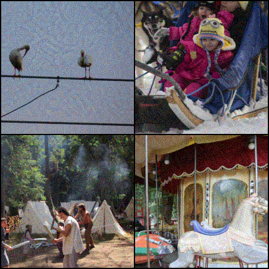
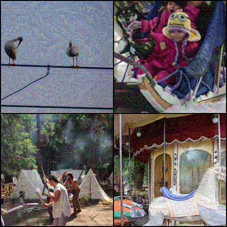

# Introduction

<figure markdown="span">
    { width=200 }
    <figcaption>Benign Image</figcaption>
</figure>
<figure markdown="span">
    { width=200 }
    <figcaption markdown>[MIFGSM](../attacks/mifgsm.md) :octicons-arrow-right-24: ResNet50</figcaption>
</figure>
<figure markdown="span">
    { width=200 }
    <figcaption markdown>[TGR](../attacks/tgr.md) :octicons-arrow-right-24: ViT-B/16</figcaption>
</figure>

## Adversarial examples

**Adversarial examples** are tricky inputs designed to confuse machine learning models.

In vision tasks like image classification, these examples are created by slightly altering an original image. The changes are so small that humans can't really notice them, yet **they can cause significant shifts in the model's prediction.**

torchattack is a library for PyTorch that offers a collection of state-of-the-art attacks to create these adversarial examples. **It focuses on transferable (1) black-box (2) attacks on image classification models.**
{ .annotate }

1. **_Transferable adversarial attacks_** are designed to fool multiple models, most often the more the better, not just the specific one they were initially created for. This means an attack effective on one model might also work on others.

2. **_Black-box attacks_** are attacks that don't require access to the model's internal parameters. Instead, they rely only on the model's inputs and outputs to launch the attack.

Attacks in torchattack are implemented over a thin layer of abstraction (`torchattack._attack.Attack`), with minimal changes to the original implementation within its research paper, along with comprehensive type hints and explanatory comments, to make it easy for researchers like me and you to use and understand.

The library also provides tools to load pretrained models, set up attacks, and run tests.

## Getting Started

To get started, follow the links below:

- [Loading pretrained models and important attributes](attack-model.md)
- [Creating and running attacks](attack-creation.md)
- [Loading a dataset and running evaluations](attack-evaluation.md)
- [A full example to evaluate transferability](putting-it-all-together.md)

Or dive straight into [all available attacks](../attacks/index.md).
